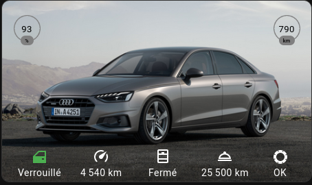

Audi Connect Integration for Home Assistant
============================================================


[](https://github.com/hacs/integration)

Description
------------

The `audiconnect` component provides an integration with the Audi Connect cloud service. It adds presence detection, sensors such as range, mileage, and fuel level, and provides car actions such as locking/unlocking and setting the pre-heater.

**Note:** Certain functions require special permissions from Audi, such as position update via GPS.

Credit for initial API discovery go to the guys at the ioBroker VW-Connect forum, who were able to figure out how the API and the PIN hashing works. Also some implementation credit to davidgiga1993 of the original [AudiAPI](https://github.com/davidgiga1993/AudiAPI) Python package, on which some of this code is loosely based.
Thank you at arjenvrh who knew how to maintain and evolve the code for many years

Installation
------------

Installation can be done manually by copying the files in this repository into the `custom_components` directory in the Home Assistant configuration directory:

1. Open the configuration directory of your Home Assistant installation.
2. If you do not have a `custom_components` directory, create it.
3. In the `custom_components` directory, create a new directory called `audiconnect`.
4. Copy all files from the `custom_components/audiconnect/` directory in this repository into the `audiconnect` directory.
5. Restart Home Assistant.
6. Add the integration to Home Assistant (see **Configuration**).

Configuration
-------------

Configuration is done through the Home Assistant UI.

[](https://my.home-assistant.io/redirect/config_flow_start/?domain=audiconnect)

### Configuration Variables

- **username** (string)(Required) The username associated with your Audi Connect account.

- **password** (string)(Required) The password for your Audi Connect account.

- **S-PIN** (string)(Optional) The S-PIN for your Audi Connect account.

- **region** (selector)(Required) The region where your Audi Connect account is registered.
  
Options
--------

**API Level**

Depending on the model, Audi changes the way of carrying out actions such as switching on the air conditioning, triggering the charge or switching on the pre-heating and ventilation

It is possible to change the level of the API call so that remote actions work.

Example: e-tron models must have an API level Climatisation of 3 to activate the air conditioning.

You can modify the following values using the options:

    API level charger [1|2] (default:1)
    API level climatisation [2|3] (default:2)
    API level ventilation [1|2] (default:1)

**BECAREFUL**: The default values are generally suitable for the majority of vehicles. Change the options only if strictly necessary.

Services
--------

**audiconnect.refresh_vehicle_data**

Normal updates retrieve data from the Audi Connect service, and don't interact directly with the vehicle. _This_ service triggers an update request from the vehicle itself. When data is retrieved successfully, Home Assistant is automatically updated. The service requires a vehicle identification number (VIN) as a parameter.

**audiconnect.execute_vehicle_action**

Perform an action on the vehicle. The service takes a VIN and the action to perform as parameters. Possible action values:

- lock
- unlock
- start_climatisation
- stop_climatisation
- start_charger
- start_timed_charger
- stop_charger
- start_preheater
- stop_preheater
- start_window_heating
- stop_window_heating

**Note:** Certain action require the S-PIN to be set in the configuration.

When an action is successfully performed, an update request is automatically triggered.

Example Dashboard Card
----------------------

Below is an example Dashboard (Lovelace) card illustrating some of the sensors this Home Assistant addon provides.



```yaml
type: picture-elements
image: '/local/audi.jpg '
elements:
  - type: state-icon
    icon: mdi:car-door
    entity: lock.audi_a4_berline_any_door_unlocked
    tap_action:
      action: toggle
    style:
      left: 12%
      top: 86%
      '--paper-item-icon-color': white
      '--paper-item-icon-active-color': red
  - type: state-label
    entity: lock.audi_a4_berline_any_door_unlocked
    style:
      color: white
      left: 12%
      top: 95%
  - type: icon
    entity: sensor.audi_a4_berline_mileage
    icon: mdi:speedometer
    style:
      color: white
      left: 32%
      top: 86%
  - type: state-label
    entity: sensor.audi_a4_berline_mileage
    style:
      color: white
      left: 32%
      top: 95%
  - type: icon
    icon: mdi:window-open
    entity: binary_sensor.audi_a4_berline_any_window_open
    style:
      color: white
      left: 52%
      top: 86%
  - type: state-label
    entity: binary_sensor.audi_a4_berline_any_window_open
    style:
      color: white
      left: 52%
      top: 95%
  - type: icon
    icon: mdi:room-service-outline
    entity: sensor.audi_a4_berline_service_inspection_distance
    style:
      color: white
      left: 72%
      top: 86%
  - type: state-label
    entity: sensor.audi_a4_berline_service_inspection_distance
    style:
      color: white
      left: 72%
      top: 95%
  - type: state-icon
    icon: mdi:tire
    entity: binary_sensor.audi_a4_berline_any_tyre_pressure
    style:
      color: white
      left: 90%
      top: 86%
      '--paper-item-icon-color': white
      '--paper-item-icon-active-color': red
  - type: state-label
    entity: binary_sensor.audi_a4_berline_any_tyre_pressure
    style:
      color: white
      left: 90%
      top: 95%
  - type: state-badge
    entity: sensor.audi_a4_berline_tank_level
    style:
      color: transparent
      left: 1%
      top: 1%
      transform: scale(0.7,0.7)
      '--label-badge-red': gray
      '--label-badge-background-color': transparent
      '--ha-label-badge-label-color': black
      '--label-badge-text-color': black
  - type: state-badge
    entity: sensor.audi_a4_berline_range
    style:
      color: transparent
      right: 1%
      top: 1%
      transform: scale(0.7,0.7)
      '--label-badge-red': gray
      '--label-badge-background-color': transparent
      '--ha-label-badge-label-color': black
      '--label-badge-text-color': black

```
